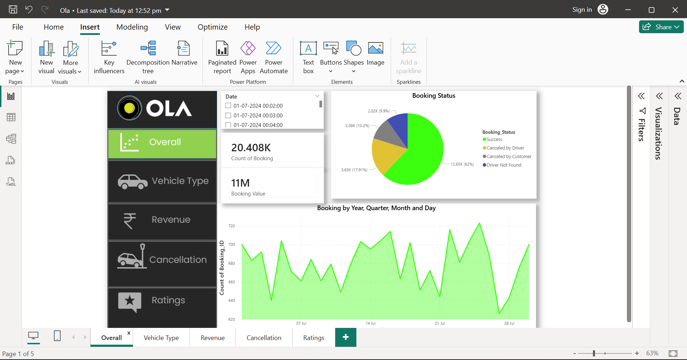
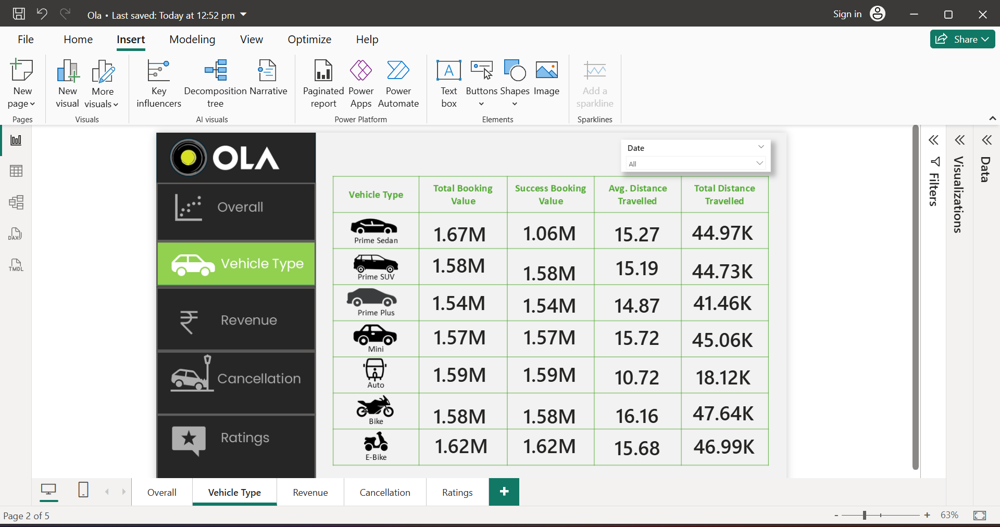
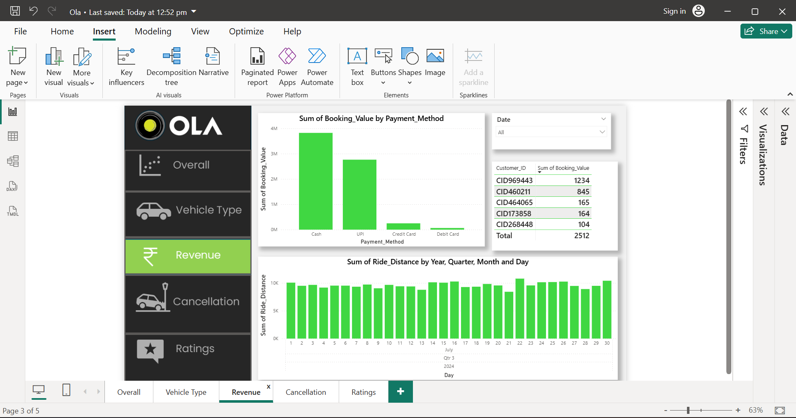
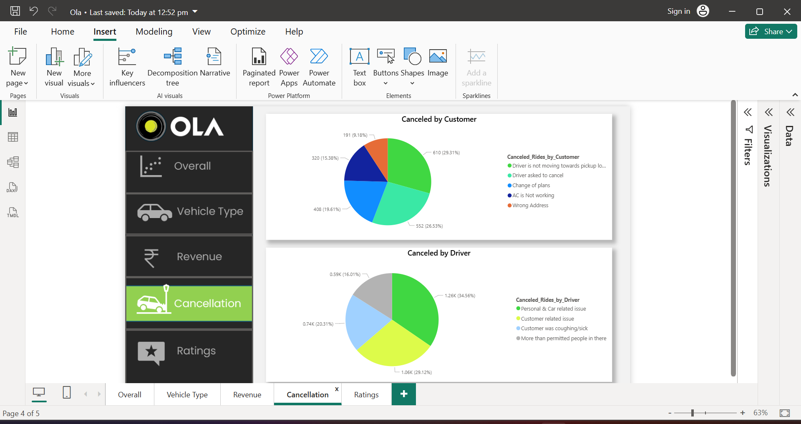
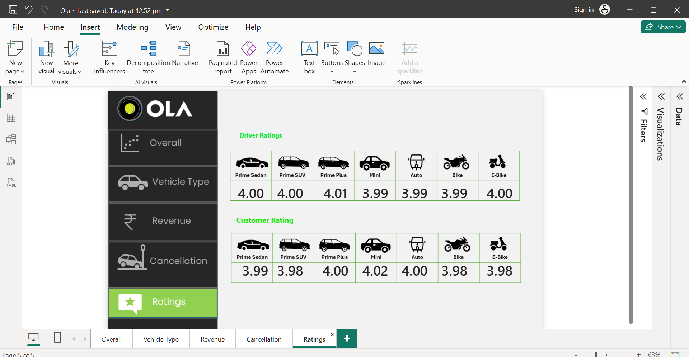

# 🚖 Ola Ride Analytics Dashboard (Power BI)

## 📌 Project Overview

This project showcases an interactive **Ola Ride Analytics Dashboard** built using Power BI to analyze ride data, customer behavior, and overall business performance. It provides actionable insights to improve decision-making and optimize operations.

---

## 🎯 Objective

To analyze Ola ride data and visualize key performance metrics such as bookings, revenue, ride patterns, cancellations, and customer ratings.

---

## 🛠️ Tools & Technologies

Power BI, SQL, Excel, Python (Pandas, NumPy)

---

## 📊 Key Insights

* Analyzed total bookings, revenue, and average ride value
* Identified peak booking hours and demand trends
* Evaluated vehicle-type performance and ride distribution
* Analyzed cancellation patterns to improve service efficiency
* Assessed customer ratings to understand user satisfaction

---

## 📂 Dataset

The dataset includes booking details, pickup & drop locations, ride time, fare amount, payment methods, vehicle type, cancellation status, and customer ratings.

---

## 📸 Dashboard Preview

### 🔹 Overall Dashboard

### 🔹 Vehicle Type Analysis

### 🔹 Revenue Analysis

### 🔹 Cancellation Analysis

### 🔹 Rating Analysis

---

## 📈 Business Impact

* Improved understanding of revenue contribution by different vehicle types
* Identified key reasons behind ride cancellations
* Helped in optimizing peak-time pricing strategies
* Enhanced customer satisfaction analysis using rating trends

---

## 🚀 Conclusion

The Ola Power BI Dashboard delivers a comprehensive analysis of ride data, enabling data-driven decisions to enhance operational efficiency, reduce cancellations, and improve customer experience.

## 📬 Contact

**Aditya Nigam**
LinkedIn:(https://www.linkedin.com/in/aditya-nigam-923179252/)

